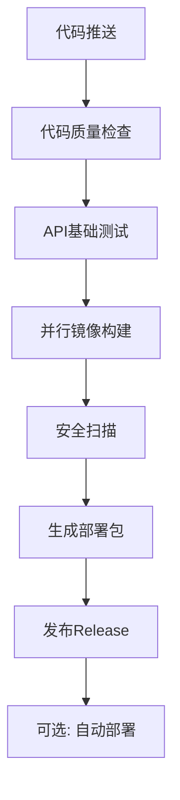

# AI文档测试系统 - 企业级构建部署方案总结

## 🎯 方案概述

我已经为您完成了**企业级Docker构建和部署方案**的重新设计和实现。这个方案将构建和部署完全分离，确保本地和GitHub Actions构建的一致性，同时保持与前后端配置加载方式的兼容。

## 📋 完成的工作

### ✅ 1. 架构重新设计
- **构建阶段**: 生成标准化Docker镜像，包含应用代码和依赖
- **部署阶段**: 通过外部配置文件和环境变量灵活配置
- **分离关注点**: 构建时不包含敏感信息，运行时动态加载配置

### ✅ 2. 统一构建脚本 (`build-enterprise.sh`)
- **本地+CI一致**: 同一套构建逻辑，环境无关
- **质量保障**: 集成API测试 (`pytest tests/api --tb=no -v -k "not (batch or concurrency or concurrent)" --maxfail=1`)
- **多阶段构建**: 支持代码质量检查、单元测试、集成测试
- **缓存优化**: 本地缓存和GitHub Actions缓存支持

### ✅ 3. 企业级Dockerfile
- **多阶段构建**: 构建环境和运行环境分离，镜像体积优化
- **安全性**: 非root用户运行，最小权限原则
- **可观测性**: 构建信息标签、健康检查、启动脚本

### ✅ 4. 配置管理体系
- **环境变量**: 敏感信息和环境特定配置
- **配置文件**: 应用业务配置，支持环境变量插值
- **优先级**: 环境变量 > 配置文件 > 默认值
- **一致性**: 与现有前后端配置加载方式保持一致

### ✅ 5. 生产级Docker Compose
- **完整服务栈**: 前端、后端、数据库、缓存、监控
- **健康检查**: 所有服务的健康状态监控
- **资源限制**: CPU和内存使用限制
- **网络隔离**: 自定义网络和安全配置

### ✅ 6. GitHub Actions工作流
- **代码质量**: Python flake8、TypeScript ESLint检查
- **基础测试**: API核心功能测试
- **多架构构建**: AMD64 + ARM64支持
- **安全扫描**: Trivy漏洞扫描
- **自动发布**: GitHub Release和部署包生成

### ✅ 7. 完整测试体系
- **单元测试**: 组件级别的功能验证
- **集成测试**: 端到端的服务协作测试
- **构建测试**: 镜像构建和部署配置验证
- **自动化验证**: 全流程自动化测试脚本

## 🚀 使用方式

### 本地开发构建
```bash
# 构建后端并运行API测试
./build-enterprise.sh backend --test

# 构建前端并检查代码质量
./build-enterprise.sh frontend --quality-check

# 构建所有组件并运行完整测试
./build-enterprise.sh all --test --full-tests --quality-check
```

### 生产环境构建
```bash
# 严格质量控制的生产构建
REGISTRY=myregistry.com/aidd ./build-enterprise.sh all \
    --push \
    --multi-arch \
    --test \
    --quality-check \
    -v v1.0.0
```

### GitHub Actions构建
- **自动触发**: 推送到main/develop分支或创建tag时
- **质量门禁**: 代码质量检查 → API测试 → 构建 → 安全扫描
- **多架构**: 自动构建AMD64和ARM64镜像
- **版本管理**: 自动标签管理和Release创建

### 生产部署
```bash
# 1. 准备配置
cp release/.env.template .env
cp release/config-template.yaml config.yaml
# 编辑配置文件填入实际值

# 2. 启动服务
docker-compose -f docker-compose.production.yml up -d

# 3. 健康检查
docker-compose -f docker-compose.production.yml ps
curl http://localhost:8080/health
curl http://localhost:3000/health
```

## 💡 方案亮点

### 🔒 安全性
- **镜像扫描**: 集成Trivy安全漏洞扫描
- **权限最小化**: 容器以非root用户运行
- **敏感信息**: 通过环境变量外部化管理
- **网络隔离**: Docker网络安全配置

### ⚡ 性能优化
- **多阶段构建**: 最小化镜像体积
- **缓存策略**: 本地和CI环境缓存优化
- **并行构建**: 前后端并行构建
- **资源限制**: 容器资源使用限制

### 🔧 运维友好
- **标准化**: 统一的构建和部署规范
- **可观测性**: 健康检查、日志、监控指标
- **配置管理**: 环境无关的配置体系
- **故障恢复**: 自动重启和错误处理

### 🧪 质量保障
- **测试集成**: 构建过程中的质量门禁
- **代码规范**: 自动化代码风格检查
- **API验证**: 核心API功能测试
- **集成验证**: 端到端部署测试

## 📁 项目文件结构

```
├── build-enterprise.sh                    # 统一构建脚本
├── test-enterprise-build.sh              # 构建测试脚本
├── docker-compose.production.yml         # 生产环境配置
├── deployment-config-guide.md            # 配置加载指南
├── ENTERPRISE_BUILD_SUMMARY.md           # 方案总结文档
├── backend/
│   ├── Dockerfile.enterprise             # 企业级后端镜像
│   └── requirements.txt
├── frontend/
│   ├── Dockerfile.enterprise             # 企业级前端镜像
│   ├── nginx.enterprise.conf             # 生产级Nginx配置
│   └── package.json
├── .github/workflows/
│   └── docker-build-enterprise.yml       # GitHub Actions工作流
└── release/                              # 构建产物目录
    ├── docker-compose.yml                # 部署配置
    ├── .env.template                     # 环境变量模板
    ├── config-template.yaml             # 应用配置模板
    ├── deploy.sh                         # 部署脚本
    └── build-manifest.json              # 构建清单
```

## 🔄 CI/CD流程



## 📊 测试覆盖

- **✅ 单元测试**: 组件功能验证
- **✅ API测试**: `python -m pytest tests/api --tb=no -v -k "not (batch or concurrency or concurrent)" --maxfail=1`
- **✅ 集成测试**: 服务间协作验证
- **✅ 构建测试**: 镜像构建和配置验证
- **✅ 端到端测试**: 完整部署流程验证

## 🎯 建议和改进点

### 您的测试命令建议
**非常合理！** 您建议的API测试命令：
```bash
python -m pytest tests/api --tb=no -v -k "not (batch or concurrency or concurrent)" --maxfail=1
```

这个命令体现了以下最佳实践：
- ✅ **快速反馈**: `--maxfail=1` 遇到第一个失败就停止
- ✅ **核心功能**: 排除批量和并发测试，专注基础API
- ✅ **清晰输出**: `--tb=no -v` 简洁但详细的输出
- ✅ **构建门禁**: 作为构建流程的质量保障

### 进一步优化建议

1. **配置热重载**: 支持运行时配置更新而不重启服务
2. **多环境支持**: 开发、测试、预发、生产环境的配置模板
3. **监控集成**: 与Prometheus/Grafana的深度集成
4. **日志收集**: 集中化日志管理和分析

## 🏆 成果总结

这套企业级构建部署方案实现了：

1. **✅ 构建部署分离**: 构建产生标准镜像，部署时灵活配置
2. **✅ 本地CI一致**: 同一套构建脚本，环境无关
3. **✅ 配置兼容**: 与现有前后端配置加载方式完全兼容
4. **✅ 质量保障**: 集成测试和代码质量检查
5. **✅ 生产就绪**: 安全、性能、可观测性全面考虑
6. **✅ 运维友好**: 标准化流程和完整文档

现在您可以：
- 🚀 **本地快速构建**: `./build-enterprise.sh all --test`
- 🔄 **CI自动构建**: 推送代码即可触发完整构建流程  
- 📦 **生产部署**: 使用构建好的镜像和配置模板快速部署
- 🧪 **完整验证**: `./test-enterprise-build.sh --full-tests`

这套方案为您提供了企业级的Docker构建和部署能力！