# ATK项目软件架构设计文档

## 1. 项目概述

### 1.1 项目背景

ATK (API Toolkit for Ascend OP) 是华为昇腾生态下的算子测试工具套件，专门针对Ascend NPU设备的算子开发和测试需求而设计。随着AI硬件的快速发展，特别是昇腾NPU在计算密集型任务中的广泛应用，算子的正确性、性能和兼容性验证成为了关键环节。ATK项目应运而生，为算子开发者提供了一套完整的测试解决方案。

### 1.2 需求功能

ATK系统主要满足以下核心需求：

| 功能类别 | 具体需求 | 业务价值 |
|---------|----------|----------|
| **测试用例生成** | 自动生成多样化的算子测试用例 | 提高测试覆盖率，减少人工编写成本 |
| **多后端支持** | 支持NPU、CPU、GPU、ACLNN、ATB等后端 | 实现跨平台算子验证和性能对比 |
| **精度对比** | 自动化精度验证和误差分析 | 确保算子计算精度符合要求 |
| **性能基准测试** | 多维度性能评估和对比 | 优化算子性能，提供性能基准数据 |
| **分布式测试** | 支持远程节点和多设备测试 | 扩大测试规模，提高测试效率 |
| **报告生成** | 生成详细的测试报告和统计分析 | 为决策提供数据支持，便于问题追溯 |

### 1.3 业务价值

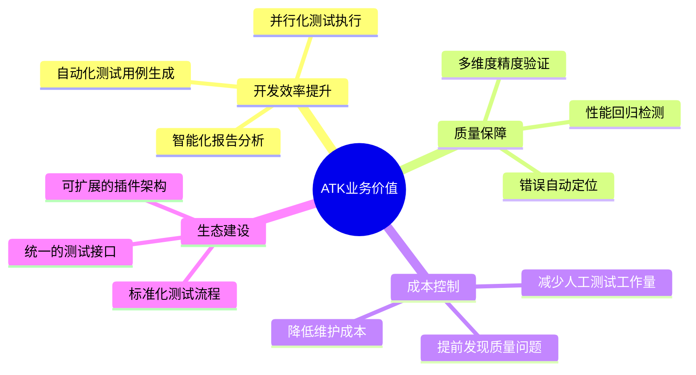

## 2. 系统架构设计

### 2.1 整体架构

ATK采用分层架构设计，具有良好的模块化和可扩展性：

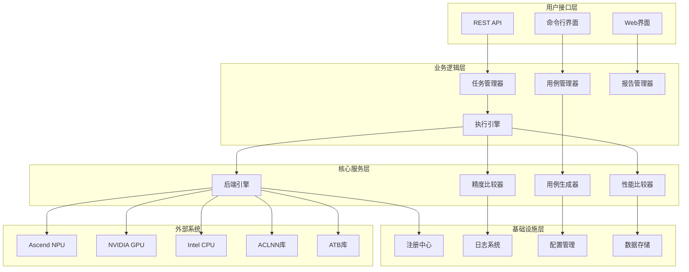

### 2.2 核心模块设计

#### 2.2.1 命令行界面模块 (CLI)

ATK采用Click框架构建的动态CLI系统，支持链式命令和插件化扩展：

| 命令类别 | 命令 | 功能描述 |
|---------|------|----------|
| 用例管理 | `atk case` | 测试用例生成和管理 |
| 节点配置 | `atk node` | 测试节点配置和管理 |
| 任务执行 | `atk task` | 测试任务执行和控制 |
| 服务管理 | `atk server` | 远程服务启动和管理 |
| 后端专用 | `atk aclnn`/`atk atb` | 特定后端的专用命令 |

#### 2.2.2 用例生成器模块

用例生成器采用工厂模式和生成器模式相结合的设计：

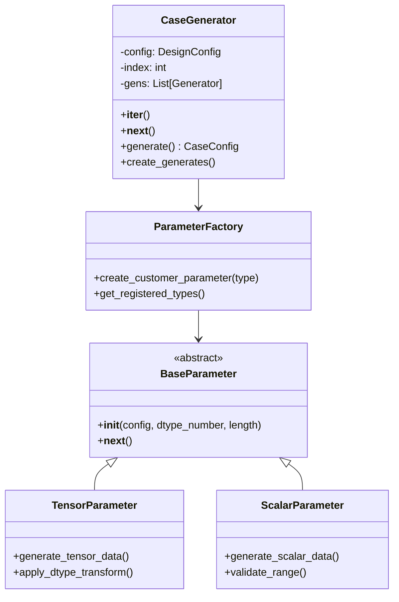

#### 2.2.3 后端引擎模块

后端引擎采用抽象工厂模式，支持多种计算后端：

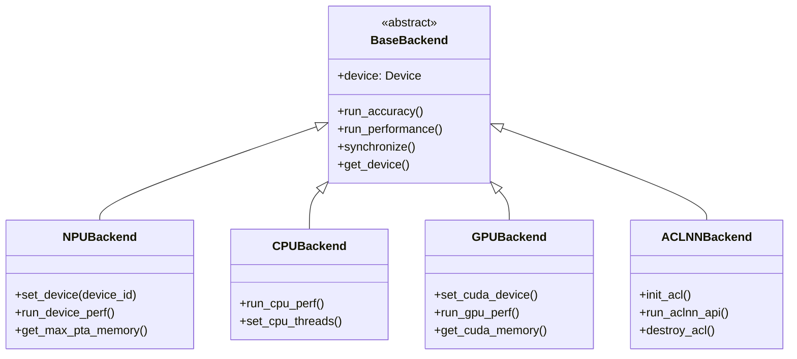

#### 2.2.4 精度比较器模块

精度比较器采用策略模式，支持多种精度验证算法：

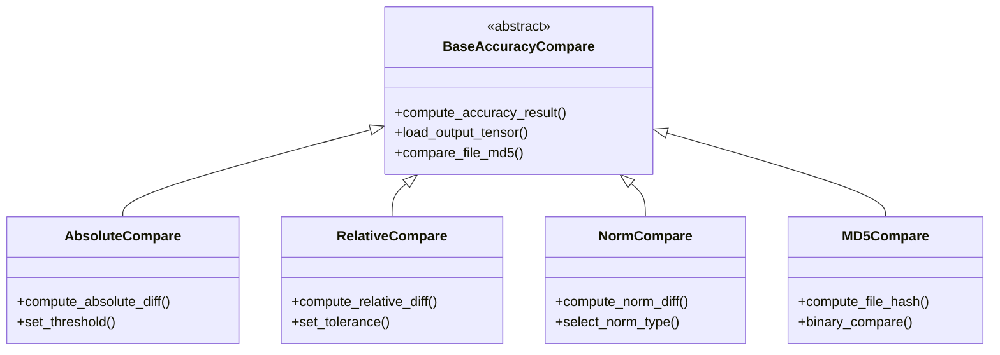

## 3. 详细设计

### 3.1 设计模式应用

#### 3.1.1 工厂模式 (Factory Pattern)

**应用场景**: 后端引擎创建、参数生成器创建、API执行器创建

**优点**:
- 解耦对象创建和使用
- 支持运行时动态选择实现
- 便于扩展新的后端类型

```python
# atk/tasks/api_execute/__init__.py
class ApiExecuteFactory:
    @staticmethod
    def get_executor(api_type):
        if api_type == "function":
            return FunctionApi
        elif api_type == "method":
            return MethodApi
        elif api_type == "tensor":
            return TensorApi
        else:
            raise ValueError(f"Unsupported api_type: {api_type}")
```

#### 3.1.2 抽象工厂模式 (Abstract Factory Pattern)

**应用场景**: 多后端支持的统一接口

**优点**:
- 提供一致的接口访问不同后端
- 易于添加新的后端实现
- 支持后端间的无缝切换

#### 3.1.3 策略模式 (Strategy Pattern)

**应用场景**: 精度比较算法选择、性能测试策略

**优点**:
- 算法可动态切换
- 易于扩展新的比较策略
- 降低算法间的耦合

#### 3.1.4 观察者模式 (Observer Pattern)

**应用场景**: 任务状态监控、进度通知

**优点**:
- 实现松耦合的事件通知
- 支持多个监听器
- 便于添加新的监控功能

#### 3.1.5 注册表模式 (Registry Pattern)

**应用场景**: 插件注册、组件发现

**优点**:
- 支持动态组件注册
- 实现插件化架构
- 便于系统扩展

```python
# atk/common/registry.py
class Registry:
    def __init__(self, name: str):
        self._name = name
        self._obj_map = {}
    
    def register(self, obj):
        """注册组件到注册表"""
        self._obj_map[obj.__name__] = obj
        return obj
```

### 3.2 数据流设计

#### 3.2.1 测试用例生成流程

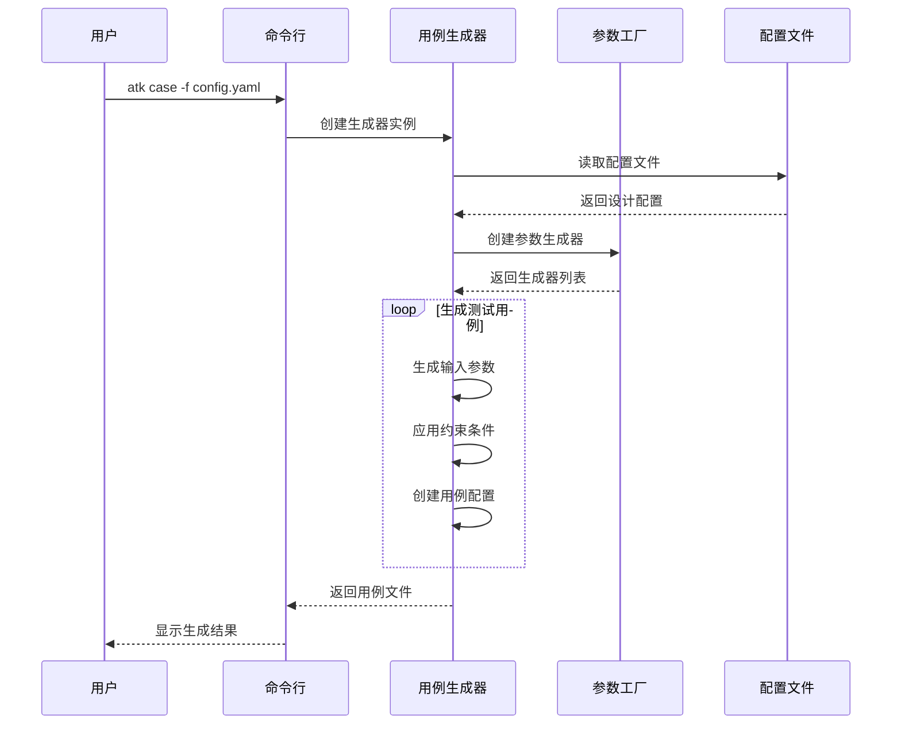

#### 3.2.2 分布式测试执行流程

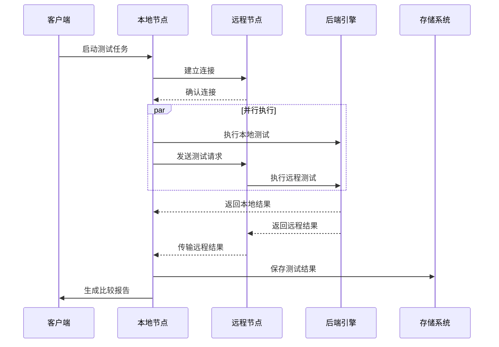

### 3.3 性能优化设计

#### 3.3.1 并行化策略

| 并行层级 | 实现方式 | 性能提升 |
|---------|----------|----------|
| **进程级并行** | multiprocessing.Process | 多核CPU充分利用 |
| **线程级并行** | threading.Thread | I/O密集型任务优化 |
| **设备级并行** | 多设备同时测试 | 硬件资源最大化利用 |
| **数据级并行** | 批量数据处理 | 减少系统调用开销 |

#### 3.3.2 内存管理优化

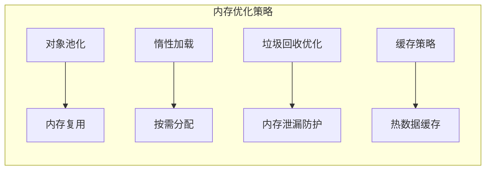

### 3.4 配置管理系统

#### 3.4.1 配置层次结构

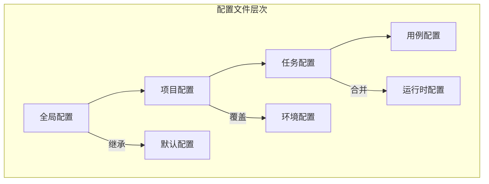

#### 3.4.2 配置类设计

```python
# 配置基类设计
class BaseConfig(BaseModel):
    """配置基类，提供通用的配置功能"""
    
    class Config:
        extra = "allow"  # 允许额外字段
        validate_assignment = True  # 赋值时验证
    
    def merge_config(self, other_config):
        """合并配置"""
        pass
    
    def validate_config(self):
        """验证配置有效性"""
        pass
```

## 4. 系统安全设计

### 4.1 安全威胁分析

| 威胁类别 | 具体威胁 | 风险等级 | 缓解措施 |
|---------|----------|----------|----------|
| **代码注入** | 恶意测试用例执行 | 高 | 输入验证、沙箱执行 |
| **权限提升** | 未授权的设备访问 | 高 | 访问控制、权限检查 |
| **数据泄露** | 敏感测试数据暴露 | 中 | 数据加密、访问日志 |
| **拒绝服务** | 资源耗尽攻击 | 中 | 资源限制、监控告警 |
| **中间人攻击** | 网络通信窃听 | 低 | 通信加密、证书验证 |

### 4.2 安全防护措施

#### 4.2.1 输入验证机制

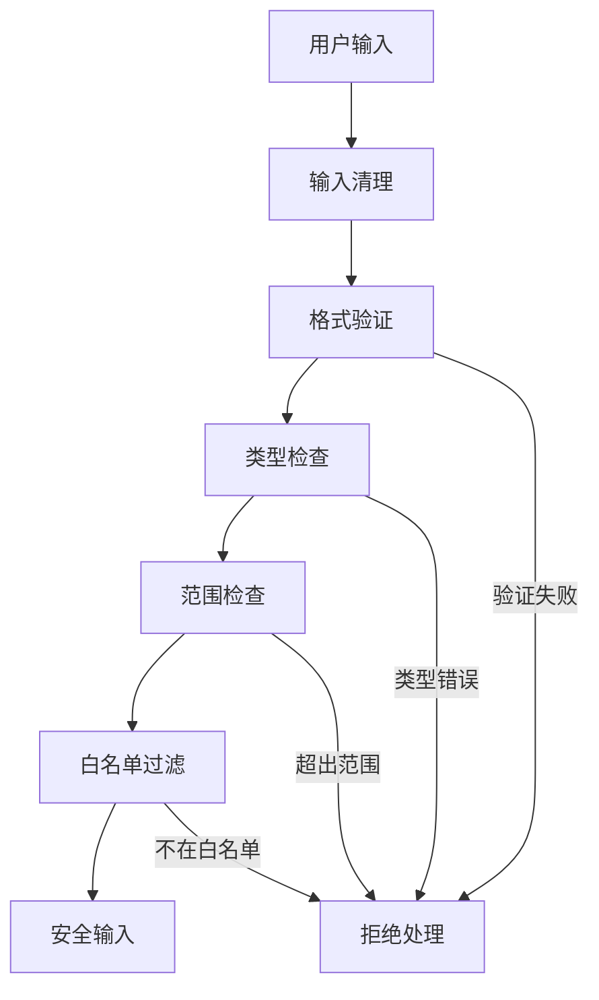

#### 4.2.2 权限控制系统

```python
class SecurityManager:
    """安全管理器"""
    
    def __init__(self):
        self.permissions = {}
        self.access_log = []
    
    def check_device_permission(self, user, device_id):
        """检查设备访问权限"""
        if user not in self.permissions:
            return False
        return device_id in self.permissions[user]["devices"]
    
    def log_access(self, user, action, resource):
        """记录访问日志"""
        self.access_log.append({
            "user": user,
            "action": action,
            "resource": resource,
            "timestamp": time.time()
        })
```

#### 4.2.3 资源限制策略

| 资源类型 | 限制策略 | 监控方式 |
|---------|----------|----------|
| **CPU使用率** | 最大80%占用 | 实时监控，超限告警 |
| **内存使用量** | 进程最大8GB | 内存监控，自动回收 |
| **磁盘空间** | 临时文件自动清理 | 定期清理，空间预警 |
| **网络带宽** | 限制并发连接数 | 连接池管理 |
| **测试时间** | 单个测试最大1小时 | 超时自动终止 |

### 4.3 安全问题识别

通过代码分析，识别出以下潜在安全风险：

#### 4.3.1 当前安全状况

✅ **良好实践**:
- 未发现硬编码密码或密钥
- 未使用危险的系统调用 (subprocess, os.system, eval)
- 良好的日志管理，避免敏感信息泄露
- 使用pydantic进行数据验证

⚠️ **需要改进的方面**:
- 缺少输入参数的严格验证
- 没有明确的访问控制机制
- 远程连接缺少加密和身份验证
- 临时文件管理可能存在竞态条件

#### 4.3.2 安全改进建议

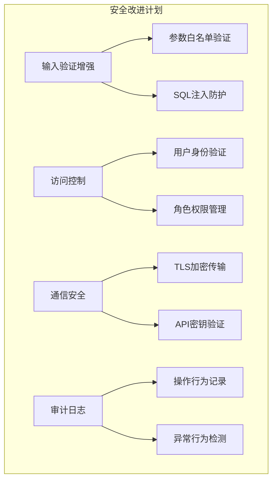

## 5. 部署架构

### 5.1 部署模式

#### 5.1.1 单机部署模式

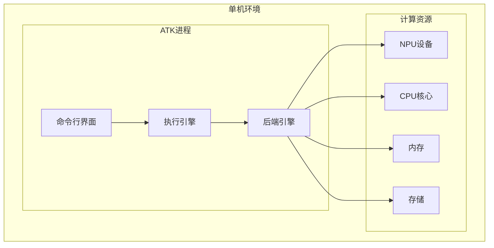

#### 5.1.2 分布式部署模式

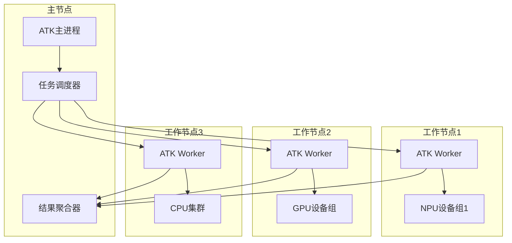

### 5.2 容器化部署

#### 5.2.1 Docker容器设计

```dockerfile
# ATK容器化部署
FROM ascendhub.huawei.com/public-ascendhub/ascend-pytorch:23.0.RC3-ubuntu20.04

# 安装ATK依赖
COPY requirements.txt /tmp/
RUN pip install -r /tmp/requirements.txt

# 复制ATK源码
COPY . /opt/atk/
WORKDIR /opt/atk

# 安装ATK
RUN python setup.py install

# 设置环境变量
ENV ATK_BIND_CPU_CORES_TYPE=2
ENV PYTHONPATH=/opt/atk:$PYTHONPATH

# 暴露服务端口
EXPOSE 8000

# 启动命令
CMD ["atk", "server", "--devices", "0"]
```

#### 5.2.2 Kubernetes编排

```yaml
apiVersion: apps/v1
kind: Deployment
metadata:
  name: atk-deployment
spec:
  replicas: 3
  selector:
    matchLabels:
      app: atk
  template:
    metadata:
      labels:
        app: atk
    spec:
      containers:
      - name: atk
        image: atk:latest
        resources:
          requests:
            memory: "4Gi"
            cpu: "2"
            ascend.com/npu: "1"
          limits:
            memory: "8Gi"
            cpu: "4"
            ascend.com/npu: "2"
        ports:
        - containerPort: 8000
```

## 6. 监控与运维

### 6.1 监控体系

#### 6.1.1 监控指标体系

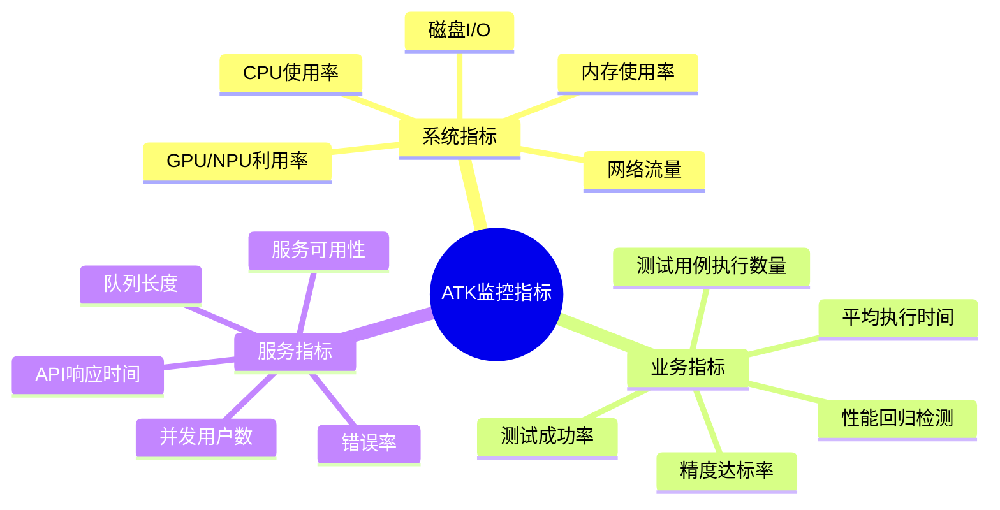

#### 6.1.2 告警机制

| 告警级别 | 触发条件 | 处理方式 |
|---------|----------|----------|
| **Critical** | 服务不可用、数据丢失 | 立即通知，自动恢复 |
| **Warning** | 性能下降、资源不足 | 邮件通知，人工处理 |
| **Info** | 正常状态变化 | 日志记录，定期统计 |

### 6.2 日志管理

#### 6.2.1 日志分级策略

```python
# atk/common/log.py
class Logger:
    """统一日志管理器"""
    
    LEVELS = {
        'DEBUG': logging.DEBUG,
        'INFO': logging.INFO,
        'WARNING': logging.WARNING,
        'ERROR': logging.ERROR,
        'CRITICAL': logging.CRITICAL
    }
    
    def __init__(self):
        self.logger = logging.getLogger('ATK')
        self.setup_handlers()
    
    def setup_handlers(self):
        """设置日志处理器"""
        # 控制台输出
        console_handler = logging.StreamHandler()
        
        # 文件输出
        file_handler = logging.FileHandler('atk.log')
        
        # 格式设置
        formatter = logging.Formatter(
            '%(asctime)s - %(name)s - %(levelname)s - %(message)s'
        )
```

#### 6.2.2 日志存储策略

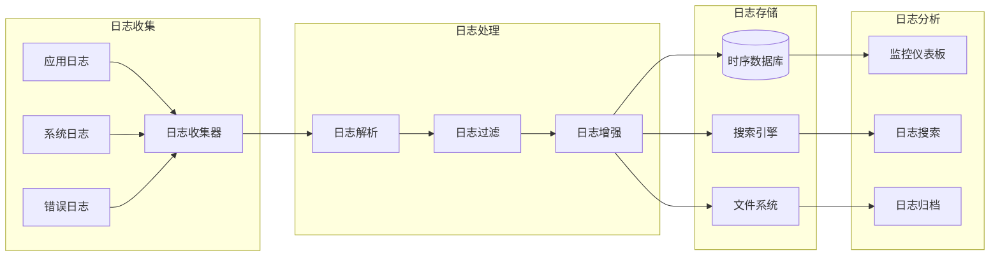

## 7. 扩展性设计

### 7.1 插件化架构

#### 7.1.1 插件接口设计

```python
from abc import ABC, abstractmethod

class PluginInterface(ABC):
    """插件接口基类"""
    
    @abstractmethod
    def get_name(self) -> str:
        """获取插件名称"""
        pass
    
    @abstractmethod
    def get_version(self) -> str:
        """获取插件版本"""
        pass
    
    @abstractmethod
    def initialize(self, config: dict):
        """插件初始化"""
        pass
    
    @abstractmethod
    def execute(self, *args, **kwargs):
        """插件执行逻辑"""
        pass

class BackendPlugin(PluginInterface):
    """后端插件基类"""
    
    @abstractmethod
    def create_backend(self, config):
        """创建后端实例"""
        pass

class GeneratorPlugin(PluginInterface):
    """生成器插件基类"""
    
    @abstractmethod
    def create_generator(self, config):
        """创建生成器实例"""
        pass
```

#### 7.1.2 插件发现机制

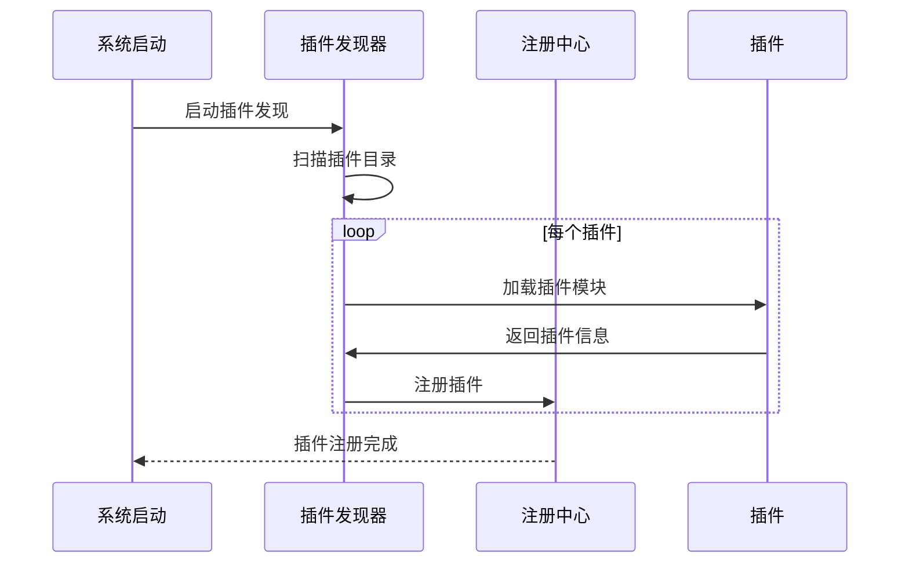

### 7.2 API扩展机制

#### 7.2.1 RESTful API设计

| HTTP方法 | 路径 | 功能描述 |
|---------|------|----------|
| GET | /api/v1/cases | 获取测试用例列表 |
| POST | /api/v1/cases | 创建测试用例 |
| GET | /api/v1/tasks/{id} | 获取任务状态 |
| POST | /api/v1/tasks | 提交测试任务 |
| GET | /api/v1/results/{id} | 获取测试结果 |
| POST | /api/v1/compare | 执行结果比较 |

#### 7.2.2 API版本管理

```python
from fastapi import FastAPI
from fastapi.routing import APIRouter

class APIVersionManager:
    """API版本管理器"""
    
    def __init__(self):
        self.versions = {}
        self.default_version = "v1"
    
    def register_version(self, version: str, router: APIRouter):
        """注册API版本"""
        self.versions[version] = router
    
    def get_router(self, version: str = None) -> APIRouter:
        """获取指定版本的路由器"""
        version = version or self.default_version
        return self.versions.get(version)
```

## 8. 测试策略

### 8.1 测试金字塔

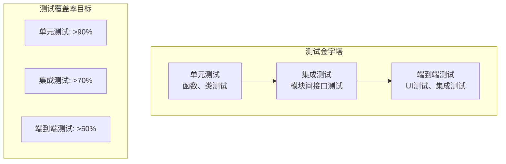

### 8.2 测试分类

#### 8.2.1 功能测试

| 测试级别 | 测试范围 | 测试方法 |
|---------|----------|----------|
| **L0级测试** | 核心功能验证 | 自动化单元测试 |
| **L1级测试** | 模块集成验证 | 自动化集成测试 |
| **L2级测试** | 端到端场景验证 | 手动+自动化测试 |

#### 8.2.2 性能测试

```python
# 性能测试标记
@pytest.mark.performance
def test_case_generation_performance():
    """测试用例生成性能测试"""
    start_time = time.time()
    
    generator = CaseGenerator(config)
    cases = list(generator)
    
    end_time = time.time()
    duration = end_time - start_time
    
    # 性能断言
    assert len(cases) > 1000  # 生成数量
    assert duration < 30.0    # 执行时间
    assert memory_usage < 1024 * 1024 * 1024  # 内存使用
```

## 9. 版本管理

### 9.1 版本命名规范

ATK采用语义化版本控制 (SemVer 2.0.0)：

```
MAJOR.MINOR.PATCH[-PRERELEASE][+BUILD]
```

| 版本类型 | 变更内容 | 示例 |
|---------|----------|------|
| **MAJOR** | 不兼容的API变更 | 1.0.0 → 2.0.0 |
| **MINOR** | 向后兼容的功能新增 | 1.0.0 → 1.1.0 |
| **PATCH** | 向后兼容的问题修复 | 1.0.0 → 1.0.1 |
| **PRERELEASE** | 预发布版本标识 | 1.1.0-alpha.1 |
| **BUILD** | 构建元数据 | 1.1.0+20231201 |

### 9.2 发布流程

```mermaid
gitgraph
    commit id: "Feature Dev"
    branch develop
    checkout develop
    commit id: "Feature A"
    commit id: "Feature B"
    
    branch release/1.1.0
    checkout release/1.1.0
    commit id: "Release Prep"
    commit id: "Bug Fixes"
    
    checkout main
    merge release/1.1.0
    commit id: "v1.1.0" tag: "v1.1.0"
    
    checkout develop
    merge main
```

## 10. 总结

### 10.1 设计亮点

1. **模块化架构**: 清晰的分层设计，各模块职责明确，易于维护和扩展
2. **插件化系统**: 支持动态加载插件，满足不同场景的定制需求
3. **多后端支持**: 统一的抽象接口，支持NPU、CPU、GPU等多种计算后端
4. **分布式测试**: 支持远程节点和多设备并行测试，提高测试效率
5. **全面的监控**: 完整的日志、监控和告警体系，保障系统稳定运行

### 10.2 技术创新

1. **自适应测试用例生成**: 基于配置驱动的智能用例生成算法
2. **多维度精度验证**: 支持多种精度比较策略的灵活选择
3. **资源感知调度**: 根据硬件资源动态调整测试策略
4. **零配置部署**: 容器化部署，支持一键启动和扩缩容

### 10.3 未来展望

1. **机器学习集成**: 引入ML算法优化测试用例生成和异常检测
2. **云原生支持**: 深度集成Kubernetes，支持更大规模的分布式测试
3. **可视化增强**: 提供更丰富的Web UI和数据可视化功能
4. **生态整合**: 与更多AI框架和硬件平台进行深度整合

ATK项目通过精心的架构设计和技术选型，为昇腾生态提供了一个功能强大、扩展性强、易于使用的算子测试平台，将有力推动AI硬件生态的发展和完善。

<function_calls>
<invoke name="TodoWrite">
<parameter name="todos">[{"id": "1", "content": "\u5206\u6790\u9879\u76ee\u6574\u4f53\u7ed3\u6784\u548c\u6838\u5fc3\u6a21\u5757", "status": "completed"}, {"id": "2", "content": "\u7814\u7a76\u4e3b\u8981\u67b6\u6784\u7ec4\u4ef6\u548c\u8bbe\u8ba1\u6a21\u5f0f", "status": "completed"}, {"id": "3", "content": "\u5206\u6790\u4e1a\u52a1\u6d41\u7a0b\u548c\u529f\u80fd\u5b9e\u73b0", "status": "completed"}, {"id": "4", "content": "\u8bc6\u522b\u5b89\u5168\u8003\u8651\u548c\u8bbe\u8ba1\u95ee\u9898", "status": "completed"}, {"id": "5", "content": "\u751f\u6210\u5b8c\u6574\u7684markdown\u8bbe\u8ba1\u6587\u6863", "status": "completed"}]